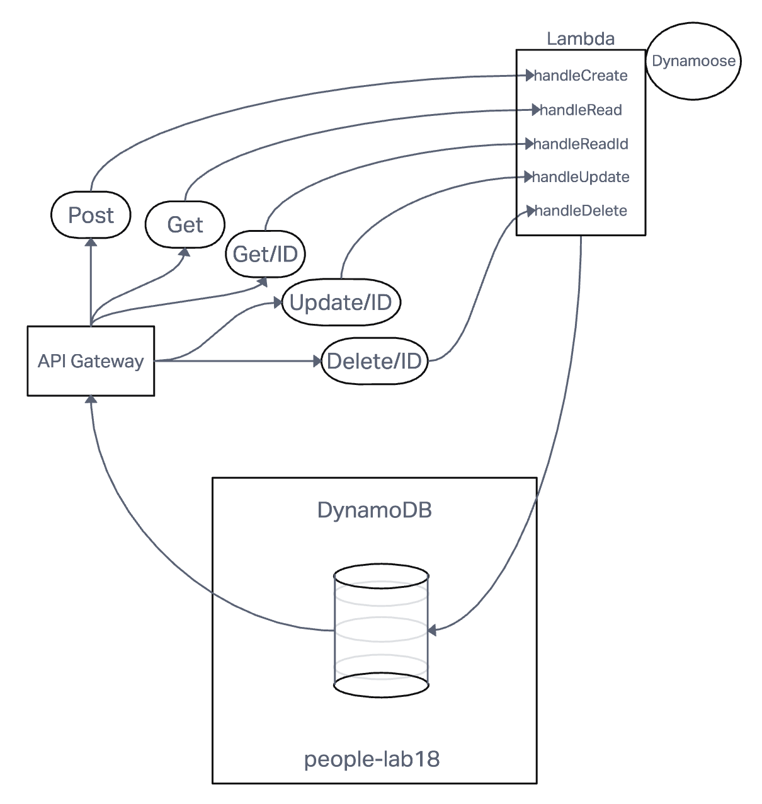

# serverless-api-

## Created by: KC Hofstetter

- What is the root URL to your API?
  - '/people-router'
- What are the routes? What inputs do they require? What output do they return?
  - Database: DynamoDB, table name: people-lab18
    - Routing: API Gateway
    - POST
      - /people - Given a JSON body, inserts a record into the database
      - returns an object representing one record, by its id (##)
    - GET
      - /people - returns an array of objects representing the records in the database
      - /people/## - returns an object representing one record, by its id (##)
    - PUT
      - /people/## - Given a JSON body and an ID (##), updates a record in the database
      - returns an object representing one record, by its id (##)
    - DELETE
      - /people/## - Given an id (##) removes the matching record from the database
      - returns an empty object
  - CRUD Operation Handlers: Lambda Functions

## Whiteboard UML

